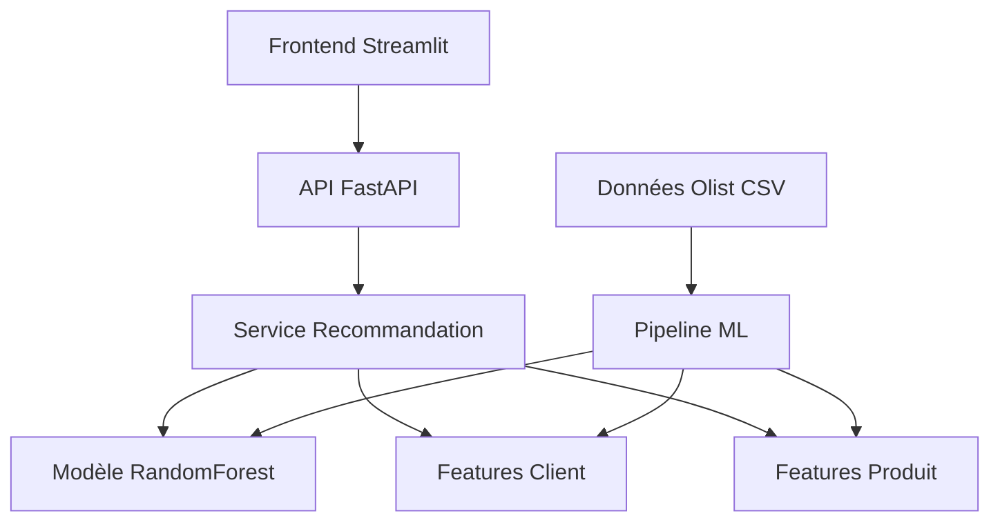

# 🛒 Olist Recommendation System

**Système de Recommandation E-commerce — Master 2 SEP**  
*Mohamed TRIBAK*

---

## 🚀 Démarrage rapide

```bash
# Installation
pip install uv
uv sync
uv run python src/scripts/setup.py
uv run python src/scripts/train.py                      # Recommandation
uv run python src/scripts/train_satisfaction.py         # Satisfaction client (optionnel)

# Lancer l'app (2 terminaux)
uv run uvicorn src.backend.app.main:app --reload    # Terminal 1 → http://localhost:8000
uv run streamlit run src/frontend/app.py            # Terminal 2 → http://localhost:8501

# Tests
uv run pytest tests/ -v
```

| Lien | URL |
|------|-----|
| **API** | http://localhost:8000 |
| **Docs** | http://localhost:8000/docs |
| **Health** | http://localhost:8000/api/v1/health |
| **Frontend** | http://localhost:8501 |

---

## Vue d'ensemble du Projet

Ce projet implémente un **système de recommandation complet** pour la plateforme e-commerce Olist. Il démontre l'intégration de machine learning en production avec une architecture moderne séparant le frontend du backend.

### Objectifs Pédagogiques

- **Machine Learning en production** : Pipeline complet de données, entraînement et déploiement
- **Architecture logicielle moderne** : API REST, microservices, séparation des responsabilités
- **Data Science appliquée** : Feature engineering, validation de modèle, métriques business
- **Stack technologique actuelle** : FastAPI, Streamlit, scikit-learn

### Démonstration

Le système permet de :
- Générer des recommandations personnalisées pour chaque client
- Visualiser les performances des modèles ML (recommandation + satisfaction) en temps réel
- Prédire la satisfaction client (score d’avis 1–5) via un simulateur dans Streamlit
- Explorer les données et analyser les patterns
- Tester l’API via une interface utilisateur intuitive

---

## Architecture du Système



### Composants Principaux

| Composant | Technologie | Responsabilité |
|-----------|-------------|----------------|
| **Frontend** | Streamlit | Interface utilisateur, visualisations |
| **Backend API** | FastAPI | Endpoints REST, validation, documentation |
| **Service ML** | scikit-learn | Modèle de recommandation, prédictions |
| **Pipeline Data** | Pandas, NumPy | Preprocessing, feature engineering |
| **Données** | CSV (demo) | Dataset Olist simplifié |

---

## Installation et Configuration

### Prérequis

- **Python 3.12+**
- **UV** (gestionnaire de paquets) — `pip install uv` ou [astral.sh/uv](https://astral.sh/uv)
- **Git** (optionnel)

### Installation (UV uniquement)

```bash
# 1. Cloner le projet
git clone <url-du-repo>
cd <nom-du-projet>

# 2. Installer UV (si besoin)
pip install uv

# 3. Dépendances (UV uniquement)
uv sync

# 4. Données + entraînement des modèles
uv run python src/scripts/setup.py
uv run python src/scripts/train.py                      # Modèle de recommandation
uv run python src/scripts/train_satisfaction.py         # Modèle de satisfaction client (optionnel)
```

## Lancement de l'Application

### En local (UV)

Après `uv run python src/scripts/setup.py`, `train.py` et (optionnel) `train_satisfaction.py` :

| Étape | Commande | URL |
|-------|----------|-----|
| **1. Backend** (terminal 1) | `uv run uvicorn src.backend.app.main:app --reload` | http://localhost:8000, /docs |
| **2. Frontend** (terminal 2) | `uv run streamlit run src/frontend/app.py` | http://localhost:8501 |
| **3. Tests** | `uv run pytest tests/ -v` | — |

```bash
# Terminal 1 – API
uv run uvicorn src.backend.app.main:app --reload

# Terminal 2 – Interface (Recommandations, Performance du Modèle, Satisfaction Client, Analyse des Données)
uv run streamlit run src/frontend/app.py

# Tests (optionnel)
uv run pytest tests/ -v
uv run pytest tests/ -m "not slow" -v   # exclure les tests lents
```

La page **Satisfaction Client** et les métriques « Modèle de Satisfaction Client » dans **Performance du Modèle** nécessitent d’avoir exécuté `uv run python src/scripts/train_satisfaction.py` au moins une fois.

### Avec Docker (`.devcontainer`)

Image : Python 3.12, UV, pre-commit, ruff, pytest.  
Le build exécute `src/scripts/setup.py`, puis `src/scripts/train.py` (recommandation), puis `src/scripts/train_satisfaction.py` (satisfaction client). Les deux modèles sont prêts dans l’image.

```bash
# Depuis la racine du projet
docker compose -f .devcontainer/compose.yaml up --build

# En arrière-plan
docker compose -f .devcontainer/compose.yaml up --build -d
```

| Service | Port | URL |
|---------|------|-----|
| **Backend** | 8000 | http://localhost:8000, /docs, /api/v1/health |
| **Frontend** | 8501 | http://localhost:8501 (Recommandations, Performance du Modèle, Satisfaction Client, Analyse des Données) |

```bash
# Tests et pre-commit dans le conteneur
docker compose -f .devcontainer/compose.yaml run --rm backend uv run pytest tests/ -v
docker compose -f .devcontainer/compose.yaml run --rm backend uv run pre-commit run --all-files

# Ré-entraîner les modèles dans le conteneur (optionnel, sans rebuild)
docker compose -f .devcontainer/compose.yaml run --rm backend uv run python src/scripts/train.py
docker compose -f .devcontainer/compose.yaml run --rm backend uv run python src/scripts/train_satisfaction.py
```

### Vérification du Système

| Vérification | URL |
|--------------|-----|
| **Santé de l'API** | http://localhost:8000/api/v1/health |
| **Documentation** | http://localhost:8000/docs |
| **Interface utilisateur** | http://localhost:8501 |

---

## Utilisation du Système

### Pages de l’interface Streamlit

| Page | Description |
|------|-------------|
| **Recommandations** | Sélection d’un client, génération de recommandations produits, visualisations |
| **Performance du Modèle** | Métriques et importance des features pour le modèle de **recommandation** (API) et le modèle de **satisfaction client** (local) |
| **Satisfaction Client** | Simulateur : saisie des caractéristiques commande/client → prédiction du score d’avis (1–5) |
| **Analyse des Données** | Distributions, corrélations, segmentation RFM (données de démo) |

### Génération de Recommandations

#### Via l’interface Streamlit (page « Recommandations »)

1. Sélectionner un client dans la liste
2. Choisir le nombre de recommandations
3. Cliquer sur « Générer les recommandations »
4. Analyser les résultats et visualisations

#### Via l'API REST

```bash
# Lister les clients (récupérer un customer_id)
curl "http://localhost:8000/api/v1/customers"

# Obtenir des recommandations (remplacer CUSTOMER_ID par un ID de /customers)
curl -X POST "http://localhost:8000/api/v1/recommendations" \
     -H "Content-Type: application/json" \
     -d '{"customer_id": "CUSTOMER_ID", "n_recommendations": 5}'

# Performances du modèle
curl "http://localhost:8000/api/v1/model/info"
```

### Analyse des Performances

Le système fournit plusieurs métriques :

- **Précision** : Train/Test accuracy
- **AUC-ROC** : Capacité de discrimination
- **Cross-validation** : Robustesse du modèle
- **Feature importance** : Variables les plus prédictives

---

## Entraînement des modèles

Les modèles sont sauvegardés dans `data/models/`. Ordre conseillé : setup une fois, puis entraînement de chaque modèle.  
Le modèle de **satisfaction** est requis pour la page Streamlit « Satisfaction Client » et pour les métriques « Modèle de Satisfaction Client » dans l’onglet « Performance du Modèle ».

| Étape | Commande | Fichier produit |
|-------|----------|------------------|
| **1. Données** | `uv run python src/scripts/setup.py` | `data/raw/*.csv` |
| **2. Recommandation** | `uv run python src/scripts/train.py` | `data/models/recommendation_model.joblib` |
| **3. Satisfaction client** | `uv run python src/scripts/train_satisfaction.py` | `data/models/satisfaction_model.joblib` |

```bash
# 1. Télécharger les données Olist (à faire une fois)
uv run python src/scripts/setup.py

# 2. Entraîner le modèle de recommandation
uv run python src/scripts/train.py

# 3. Entraîner le modèle de satisfaction client (review_score 1–5)
uv run python src/scripts/train_satisfaction.py
```

**Option** : préciser le dossier des données brutes avec `--data-dir` :

```bash
uv run python src/scripts/train.py --data-dir /chemin/vers/data/raw
uv run python src/scripts/train_satisfaction.py --data-dir /chemin/vers/data/raw
```

---

## Machine Learning Pipeline

### Feature Engineering

Le système utilise une approche **RFM** (Récence, Fréquence, Montant) enrichie :

```python
# Features clients principales
- total_orders          # Nombre de commandes
- total_spent           # Montant total dépensé
- avg_order_value       # Panier moyen
- days_since_last_order # Récence dernière commande
- avg_review_score      # Satisfaction moyenne
- favorite_category     # Catégorie préférée
- unique_products_bought # Diversité des achats
```

### Modèle de Recommandation

**RandomForest Classifier** avec :
- **100 arbres** pour la robustesse
- **Features hybrides** (client + produit + contexte)
- **Échantillonnage stratifié** des exemples négatifs
- **Validation croisée 5-fold**

### Modèle de Satisfaction Client

**HistGradientBoostingRegressor** (régression) pour prédire le **score d’avis** (1–5) à partir de :
- Livraison : délai réel, retard vs date estimée
- Commande : nb articles, montant, fret, panier moyen
- Client : nb commandes, dépense totale, première commande ou non
- Saisonnalité : mois, jour de la semaine  

Fichier produit : `data/models/satisfaction_model.joblib`. Entraînement : `uv run python src/scripts/train_satisfaction.py`.

### Évaluation du Modèle

```python
# Métriques calculées automatiquement
- Accuracy (train/test)
- AUC-ROC score
- Cross-validation score
- Feature importance
- Confusion matrix
```

---
## Structure du Projet

```
datamining-projet/
├── 📁 src/                     # ✨ TOUT le code source
│   ├── backend/                # API FastAPI
│   │   └── app/
│   │       ├── routers/       # Routes API (recommendations.py)
│   │       ├── services/      # Logique métier (recommendation_service.py)
│   │       ├── schemas/       # Validation Pydantic (recommendation.py)
│   │       └── main.py
│   ├── frontend/               # Interface Streamlit
│   │   └── app.py
│   ├── ml_pipeline/            # Pipeline ML
│   │   ├── models/            # Modèles (recommendation_model.py, satisfaction_model.py)
│   │   ├── preprocessing/     # Feature engineering (feature_engineering.py)
│   │   ├── train_model.py     # Entraînement recommandation
│   │   └── train_satisfaction.py  # Entraînement satisfaction client
│   ├── config/                 # Configuration centralisée
│   │   ├── __init__.py
│   │   └── settings.py        # Chemins, MLConfig, APIConfig, DataConfig
│   └── scripts/                # Scripts exécutables
│       ├── setup.py            # .env.example + téléchargement données
│       ├── train.py            # Entraînement recommandation (wrapper)
│       └── train_satisfaction.py  # Entraînement satisfaction client (wrapper)
├── 📁 data/                   # Données (raw, processed, models)
├── 📁 docs/                   # Documentation
├── 📁 tests/                   # Tests miroir (un test par module de src/)
│   ├── backend/               # Tests pour src/backend/
│   ├── frontend/              # Tests pour src/frontend/
│   ├── ml_pipeline/           # Tests pour src/ml_pipeline/
│   ├── integration/           # Tests d'intégration
│   └── unit/                  # Tests unitaires additionnels
├── 📁 .devcontainer/          # Docker (Dockerfile + compose, ports 8000 / 8501)
├── pyproject.toml
├── uv.lock
└── README.md
```

## Exercices pour les Étudiants

### Niveau Débutant

1. **Test des recommandations**
   - Tester avec différents clients
   - Observer les variations de probabilité
   - Analyser les recommandations les plus fréquentes

2. **Analyse des features**
   - Examiner l'importance des variables
   - Comprendre l'impact de chaque feature
   - Identifier les features les plus prédictives

### Niveau Intermédiaire

3. **Optimisation des hyperparamètres**
   ```python
   # Modifier dans src/config/settings.py
   class MLConfig:
       RANDOM_FOREST_PARAMS = {
           "n_estimators": 200,  # Tester 50, 100, 200
           "max_depth": 15,      # Tester 10, 15, 20
           "min_samples_split": 3,
           "min_samples_leaf": 1
       }
   ```

4. **Algorithmes alternatifs**
   - Tester XGBoost
   - Essayer LightGBM
   - Comparer les performances

5. **Déploiement**
   - Conteneuriser avec Docker : voir *Avec Docker* (`.devcontainer`) dans *Lancement de l'Application*

---

## Tests et Validation

### Tests Manuels

```bash
# 1. Santé de l'API
curl http://localhost:8000/api/v1/health

# 2. Clients disponibles
curl "http://localhost:8000/api/v1/customers"

# 3. Recommandations (utiliser un customer_id de l'étape 2)
curl -X POST "http://localhost:8000/api/v1/recommendations" \
     -H "Content-Type: application/json" \
     -d '{"customer_id": "<customer_id>", "n_recommendations": 5}'

# 4. Infos du modèle
curl "http://localhost:8000/api/v1/model/info"
```

### Tests automatisés
```bash
uv run pytest tests/ -v
```

---

## Ressources et Documentation

### Documentation Technique

- **[FastAPI](https://fastapi.tiangolo.com/)** : Framework API moderne
- **[Streamlit](https://streamlit.io/)** : Création d'apps data science
- **[scikit-learn](https://scikit-learn.org/)** : Machine learning en Python
- **[Pandas](https://pandas.pydata.org/)** : Manipulation de données
- **[Plotly](https://plotly.com/python/)** : Visualisations interactives

### Concepts Clés

- **Recommender Systems** : Collaborative filtering, content-based
- **Feature Engineering** : RFM analysis, behavioral features
- **API Design** : REST principles, OpenAPI documentation
- **MLOps** : Model deployment, monitoring, versioning

### Dataset Olist

- **[Kaggle Olist](https://www.kaggle.com/datasets/olistbr/brazilian-ecommerce)** : Dataset original
- **Structure relationnelle** : Clients, commandes, produits, reviews
- **Business context** : E-commerce marketplace brésilien

---

## Contribution et Amélioration

### Workflow de Développement

1. **Fork** le repository
2. Créer une **branche feature** : `git checkout -b feature/nouvelle-feature`
3. **Commiter** les changements : `git commit -m "Ajout feature X"`
4. **Pusher** la branche : `git push origin feature/nouvelle-feature`
5. Ouvrir une **Pull Request**

---

## Métriques de Succès du Projet

### Objectifs d'Apprentissage
| Compétence | Niveau Attendu | Validation |
|------------|---------------|------------|
| **ML Pipeline** | Maîtrise | Modèle entraîné avec AUC > 0.7 |
| **API Development** | Intermédiaire | API fonctionnelle avec docs |
| **Frontend** | Basique | Interface utilisable |
| **Data Engineering** | Intermédiaire | Features créées correctement |
| **Architecture** | Intermédiaire | Séparation front/back respectée |

---

## Conclusion

Ce projet **Olist Recommendation System** vous donne une expérience complète du machine learning en production. Vous apprendrez :

- **Machine Learning** appliqué à un cas d'usage réel
- **Architecture logicielle** moderne et scalable
- **Data Science** orientée business et utilisateur
- **Technologies actuelles** utilisées en entreprise

**Mission accomplie quand :**
- Votre API répond aux requêtes de recommandation
- Votre interface Streamlit affiche les résultats
- Votre modèle a des performances acceptables
- Votre code est propre et documenté

---

## Bonne chance dans votre projet !
**🚀 Ready to build the future of e-commerce recommendations? Let's code!** ✨
---

## Lien Trello 

https://trello.com/b/YMaeeQZm/mon-tableau-trello

*Dernière mise à jour : Décembre 2025*
*Version : 1.0.0*
*Auteur : Mohamed TRIBAK pour Master 2 SEP*
